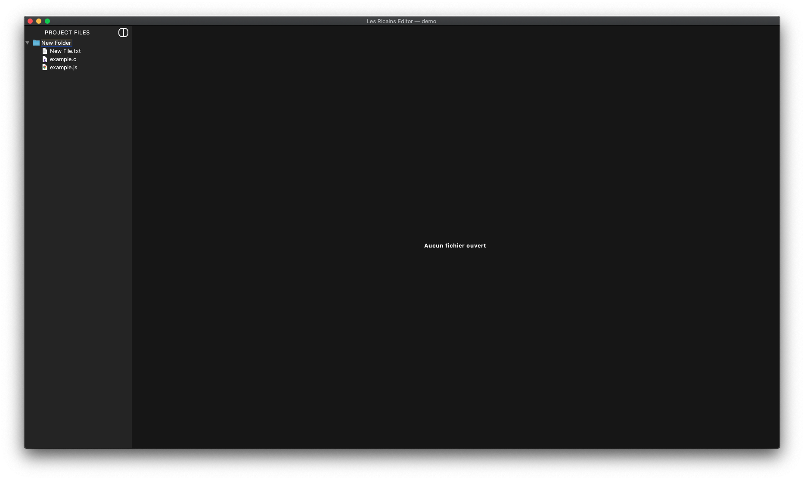
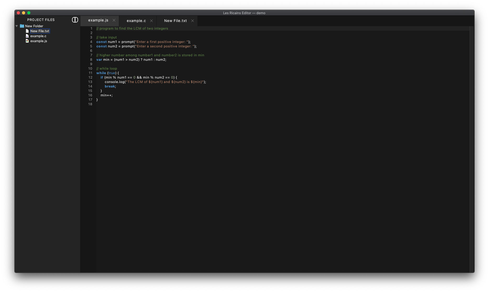
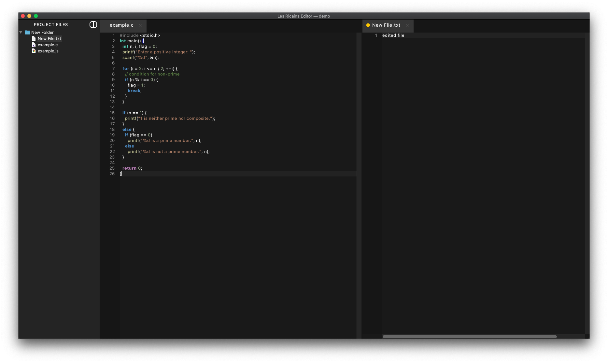
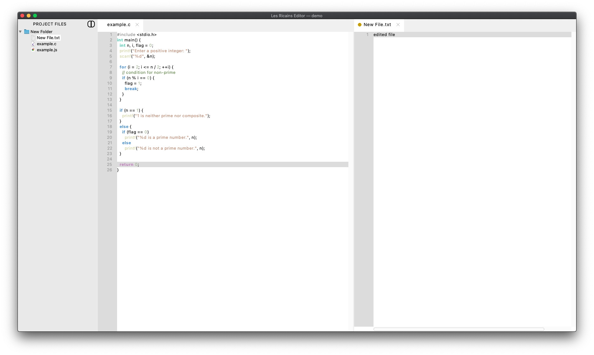

# PING
Projet de fin d'ING1 (PING) - EPITA 2023

* Members:
  - Flavien Darche
  - Antoine Petit
  - Anthony Truong
  - Sriram Vadlamani
  - Guillaume Bailly

* Group name: Les Ricains
* Goal: Implement our own IDE.
* Language JAVA (16)
* Optimized for MacOS

# Features

* Autocomplete
* Tab indent
* Syntax highlighting (based on file extension)
* Project file tree structure (view, select, create file/folder, remove)
* Dark/Light mode (persistent between restarts)
* Split window in 2 views (2 opened files)
* Open IDE with terminal (one argument: location of the project folder)
* Change color of untracked / non-commited files on git repository

# Preview

